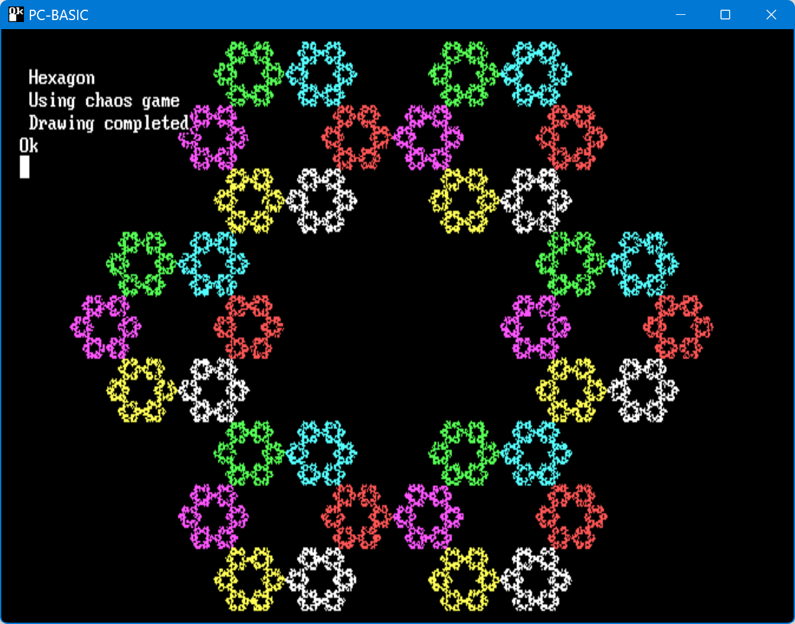
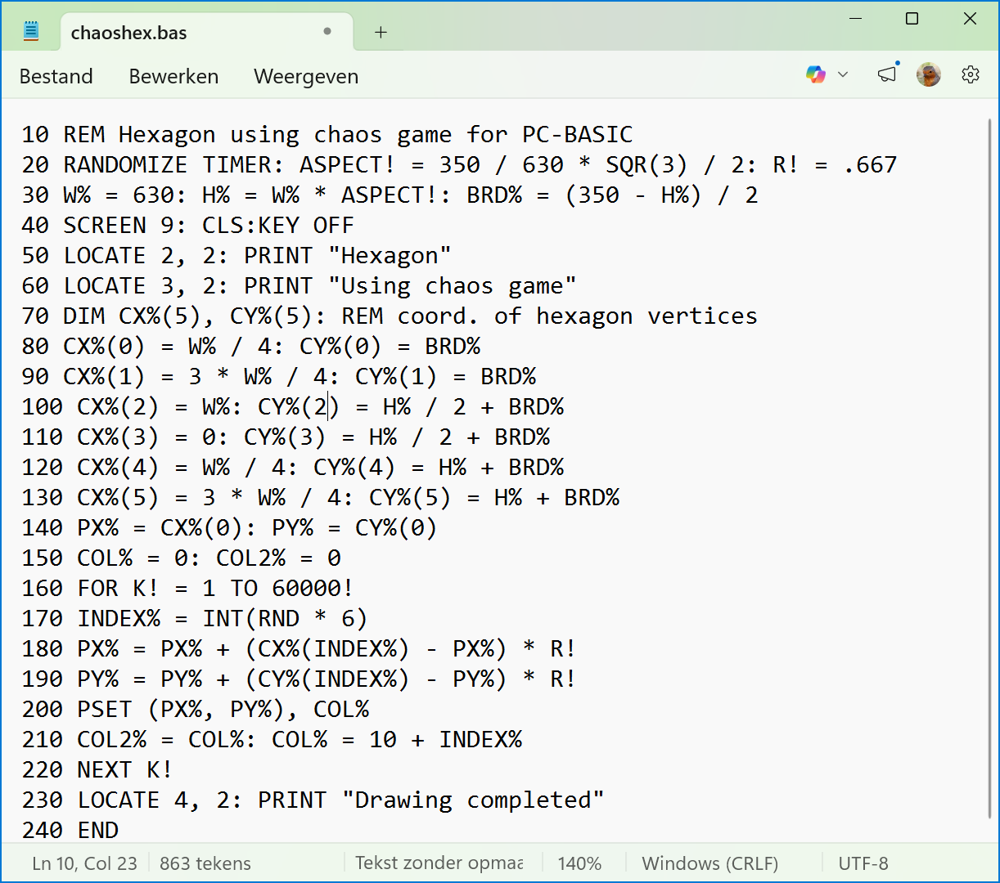
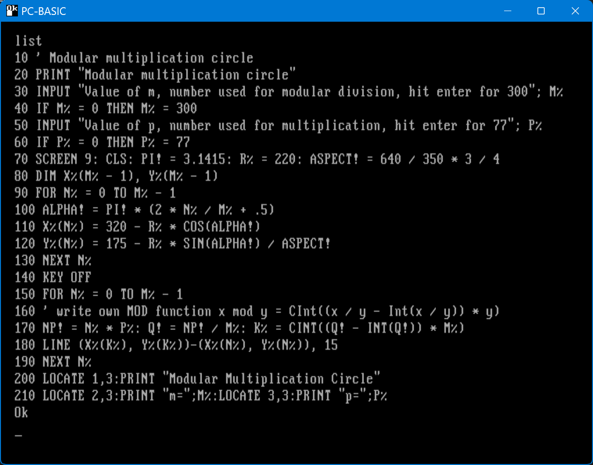
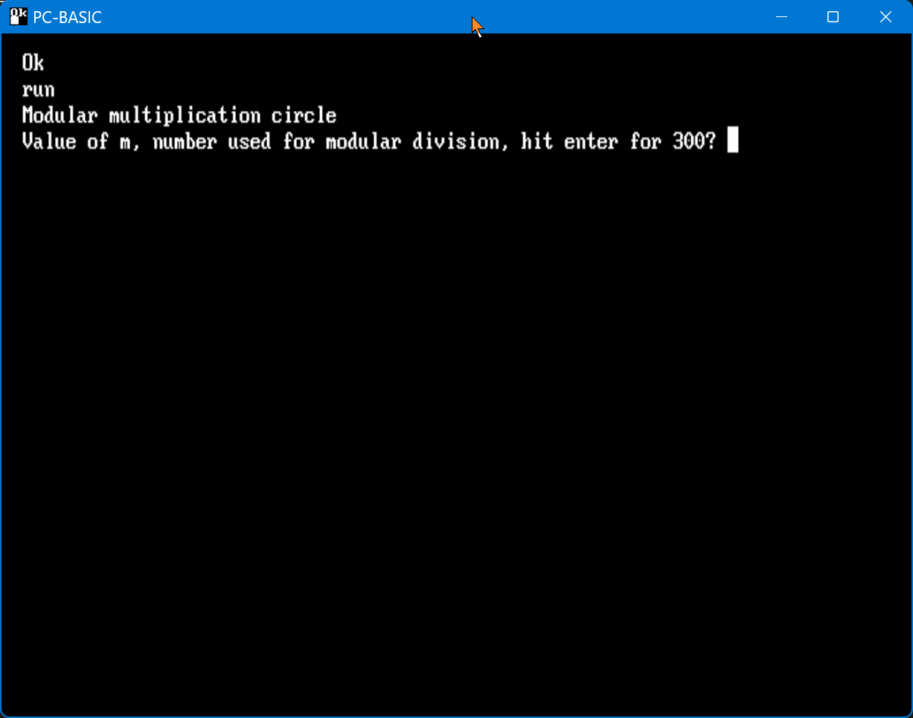
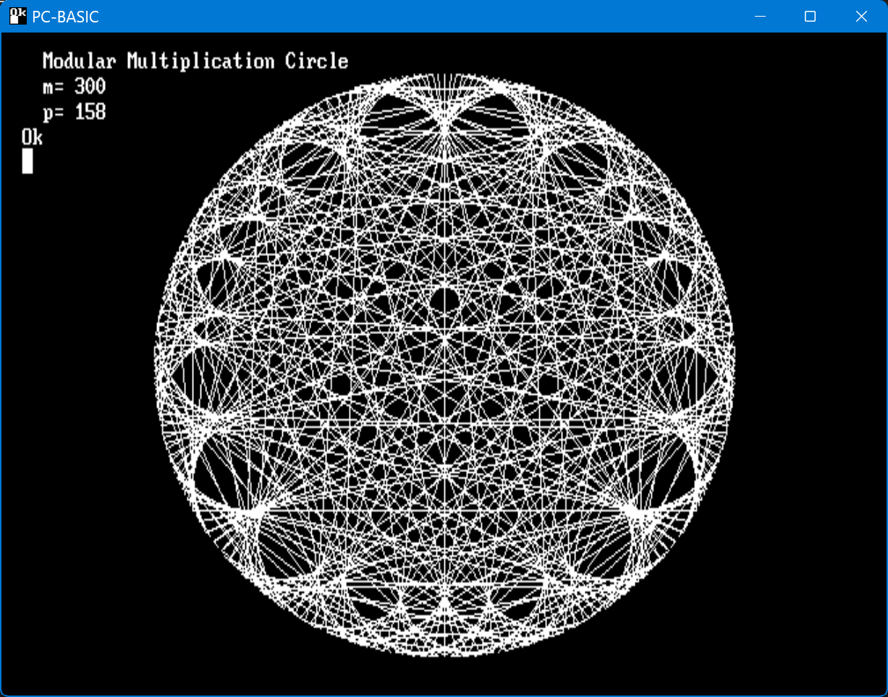
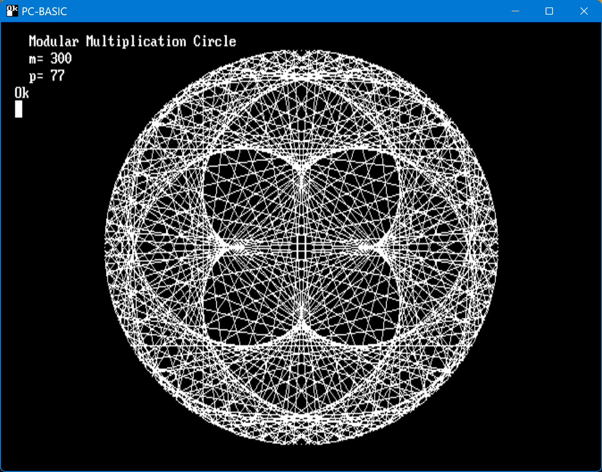

# PC-BASIC-projects
Code written for PC-BASIC, a free, cross-platform emulator for the GW-BASIC family of interpreters.
[https://robhagemans.github.io/pcbasic/](https://robhagemans.github.io/pcbasic/)

## Digital clock with 7 segment display

The display is drawn using LINE statements.

The code: [pcclock.bas](pcclock.bas)

An animated GIF recording, the real output can be smoother

## Fedora

A classic rendering of a fedora hat. Uses black vertical lines drawn from each green pixel to hide parts of the hat which should not be visible.

The code: [fedora2.bas](fedora2.bas)

## Sierpinski triangle, using 'chaos game' method

This piece of code plots a Sierpinski triangle using the method called 'Chaos game'.

    From wikipedia:
    1. Take three points in a plane to form a triangle.
    2. Randomly select any point inside the triangle and consider that your current position.
    3. Randomly select any one of the three vertex points.
    4. Move half the distance from your current position to the selected vertex.
    5. Plot the current position.
    6. Repeat from step 3.

  The code: [PCSIERP.BAS](PCSIERP.BAS)

  

  

## Hexagon, using 'chaos game' method

Constructed using a similar method as the Sierpinsky Triangle, this hexagon needs the ratio between the distance new point - old point and the distance random vertex - old point to be .667

See [wikipedia - Chaos game](https://en.wikipedia.org/wiki/Chaos_game)

The code: [chaoshex.bas](chaoshex.bas)

## Modular Multiplication Circles

Equally spaced points are placed on a circle numbered 0 to m-1. 

Second parameter p is the multiplyer. 

A line is drawn from each point n to the point with number:

    (n * p) mod m

To implement this in PC-BASIC the built in MOD function was not sufficient as it is limited to integer range −32768 to +32767. Many interesting examples need a larger range. 

The MOD function is implemented as:

     x mod y = CInt((x / y - Int(x / y)) * y)

The code: [pcmodcir.bas](pcmodcir.bas)

An example output being drawn:

