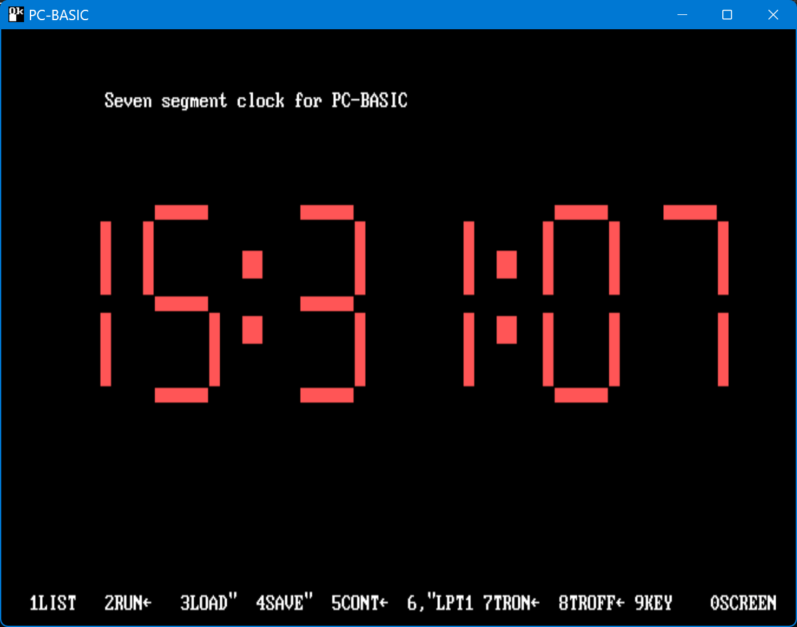
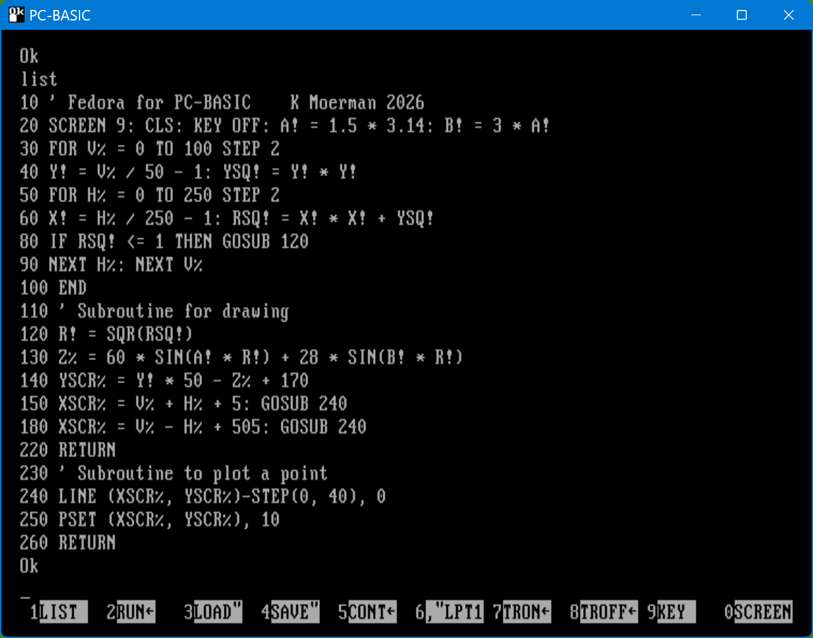
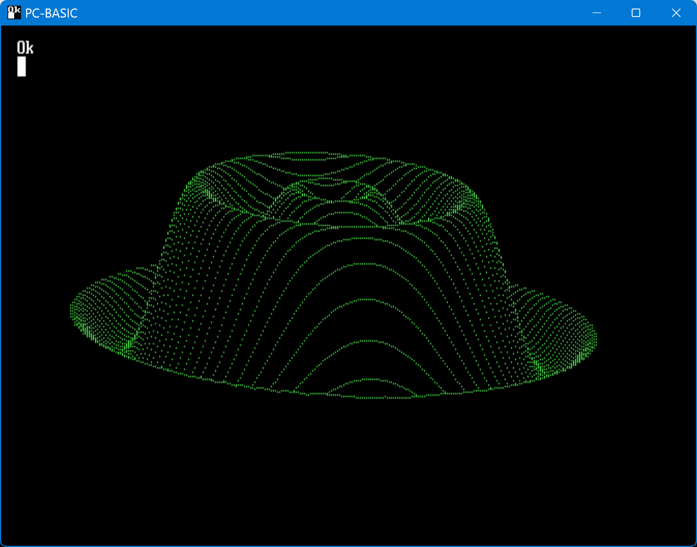
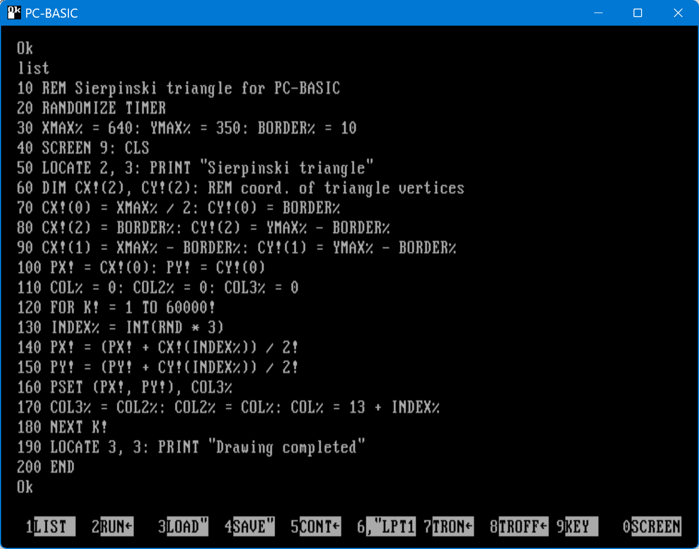
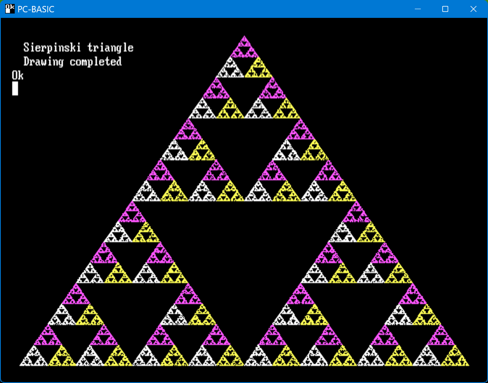

# PC-BASIC-projects
Code written for PC-BASIC, a free, cross-platform emulator for the GW-BASIC family of interpreters.
[https://robhagemans.github.io/pcbasic/](https://robhagemans.github.io/pcbasic/)

## Digital clock with 7 segment display

The display is drawn using LINE statements.

The code: [pcclock.bas](pcclock.bas)

An animated GIF recording, the real output can be smoother

## Fedora

A classic rendering of a fedora hat. Uses black vertical lines drawn from each green pixel to hide parts of the hat which should not be visible.

The code: [fedora.bas](fedora.bas)

The output:

## Sierpinski triangle

This piece of code plots a Sierpinski triangle using the method called 'Chaos game'.

    From wikipedia:
    1. Take three points in a plane to form a triangle.
    2. Randomly select any point inside the triangle and consider that your current position.
    3. Randomly select any one of the three vertex points.
    4. Move half the distance from your current position to the selected vertex.
    5. Plot the current position.
    6. Repeat from step 3.

  The code: [PCSIERP.BAS](PCSIERP.BAS)

  

  
